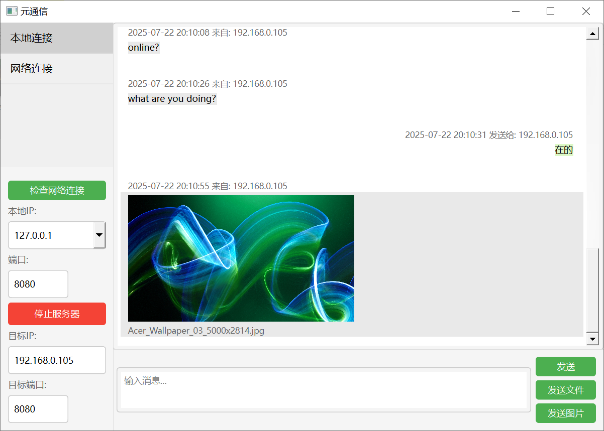

# yuan_communicate实时网络通信软件
该软件能实现在网络连接下进行在线聊天，图片、文件传输功能。

Developeing technology: Python + Pyside6 + socket

Author: Gavin.Xie
Version: 1.0.3



## 文件结构
```
├── yuan_communicate.py           # 代码脚本
```
## 如有问题，请联系
x3012378557@outlook.com

## Version
2025.07.23 v1.0.3
修复在Linux中运行的的一些问题

2025.07.09 v1.0.2
加入’检查网络连接‘功能

2025.07.02 v1.0.1
1. 优化传输图片、文件时出错的问题。
2. 修复显示正常的信息格式与时间。

2025.06.24 v1.0.0
完成初版
